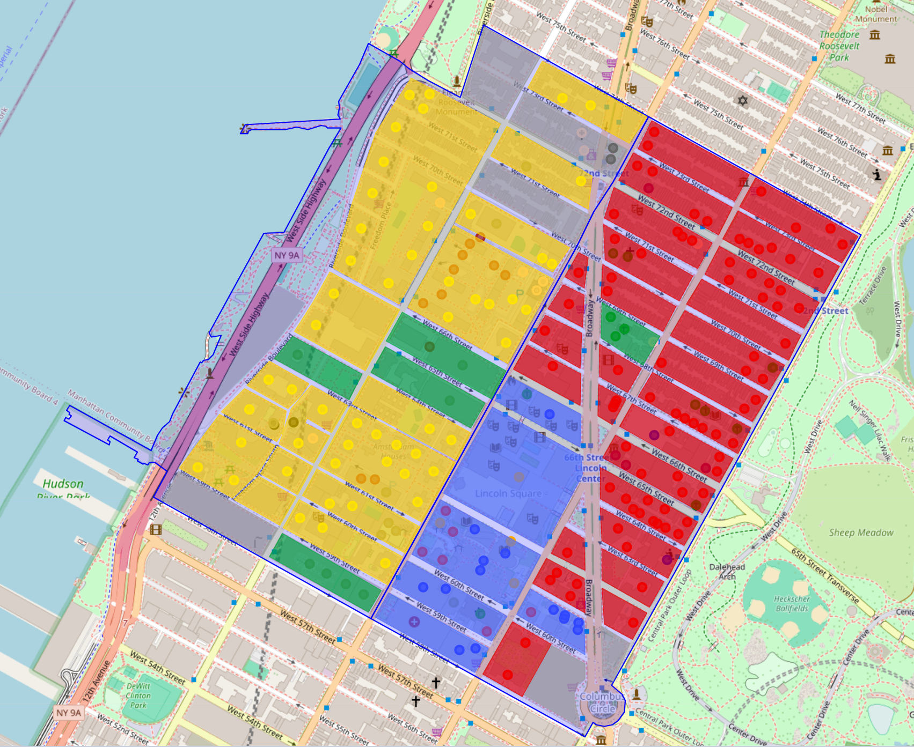

# MTUKG: A Multi-scale Temporal Urban Knowledge Graph Dataset for Knowledge-Enhanced Spatiotemporal Prediction

## 1. Overview



HUSK is a hierarchically structured urban knowledge graph dataset designed for multi-level spatial tasks. It covers entities such as POIs, roads, and regions in New York City and Chicago, and introduces "Functional Zones" as an intermediate layer to bridge micro-level POIs and macro-level administrative areas. The figure above illustrates how the added functional zones are reflected within areas. Compared to existing UrbanKG datasets, HUSK captures urban semantics and spatial relationships at a finer granularity, enabling a wide range of tasks such as crime prediction, taxi demand forecasting, and new store recommendation, with significant performance improvements across multiple benchmark models.

## 2. Installation
You can create and activate the environment required to run the project using the following commands.

```
conda create -n python3.8 MTUKG
conda activate MTUKG
pip install -r requirements.txt
```

Please ensure that you have cloned the project and entered the directory before running the above commands.

## 3. Dataset

The dataset used in this study comprises both static data and timestamped time-series data. The static data is derived from two open-source datasets within UUKG—covering spatial data for New York and Chicago—which we further filtered and refined. For the time-series data, we collected and cleaned event data for both cities. Given the substantial size of the original datasets, we have included sample data, data processing code, and model code to assist researchers in understanding our work.

The complete static data can be found in the [Folder - Google Drive](https://drive.google.com/drive/folders/1egTmnKRzTQuyW_hsbFURUonGC-bJmBHW), and the complete time-series data can be found at XXX.

We provide explanations regarding the data and preprocessing steps at [MTUKG/MTUKG_data at main · Jiahaohuhu/MTUKG](https://github.com/Jiahaohuhu/MTUKG/tree/main/MTUKG_data). Users can prepare their own urban data to construct a personalized UrbanKG/TUKG.

#### 3.1 MTUKG Data
##### 3.1.1 Data Overview

The statistical information for our raw dataset is as follows:：

| Dataset | POI    | Road   | Junc. | Area | Borough | PE     | RC     | RP     | LD     |
| ------- | ------ | ------ | ----- | ---- | ------- | ------ | ------ | ------ | ------ |
| NYC     | 109574 | 123964 | 64053 | 260  | 5       | 44208  | 314233 | 132924 | 266082 |
| CHI     | 122347 | 71578  | 34826 | 77   | 6       | 375591 | 133927 | 163945 | 118525 |

The MTUKG statistical information is as follows:

| Dataset | Entity  | Relation | Triplet | Train   | Valid  | Test    |
| ------- | ------- | -------- | ------- | ------- | ------ | ------- |
| NYC     | 1256769 | 27       | 7472392 | 5230673 | 747238 | 1494481 |
| CHI     | 1250655 | 27       | 9126146 | 7301884 | 910917 | 913345  |

The MTUKG corresponding to each city is composed of both a static graph and a temporal graph. Entities represent city characteristics at various levels, while relationships serve as edges connecting pairs of entities. We define the relationship types as follows:

| Relation | description                                                  | count                         |
| -------- | ------------------------------------------------------------ | ----------------------------- |
| PLF      | Indicates that a POI is located in a functional zone.        | NYC: 900041 / CHI: 1259606    |
| BBF      | Indicates that a block belongs to a functional zone.         | NYC: 117196 / CHI: 1116768    |
| PLA      | Indicates that a POI is located in an area.                  | NYC: 103440 / CHI: 122347     |
| RLA      | Indicates that a road is located in an area.                 | NYC: 121652 / CHI: 71578      |
| JLA      | Indicates that a junction located in an area.                | NYC: 247892 / CHI: 143156     |
| PLB      | Indicates that a POI is located in a borough.                | NYC: 103440 / CHI: 122037     |
| RLB      | Indicates that a road is located in a borough.               | NYC: 121652 / CHI: 71578      |
| JLB      | Indicates that a junction is located in a borough.           | NYC: 247892 / CHI: 143156<br> |
| FLA      | Indicates that a functional zone is located in a borough.    | NYC: 220442 / CHI: 175446<br> |
| ALB      | Indicates that an area is located in a borough.              | NYC: 284 / CHI: 123           |
| JBR      | Indicates that a junction belongs to a road.                 | NYC: 247892 / CHI: 143156     |
| BNB      | Indicates that a borough is adjacent to another borough.     | NYC: 6 / CHI: 16              |
| ANA      | Indicates that an area is adjacent to another area.          | NYC: 694 / CHI: 394           |
| PLR      | Indicates that a POI is located in a road.                   | NYC: 145461 / CHI: 162856     |
| FNF      | Indicates that a functional zone is adjacent to another one. | NYC: 732968 / CHI: 891262<br> |
| PHPC     | Indicates that the POI has a POI category.                   | NYC: 109574 / CHI: 122347     |
| RHRC     | Indicates that the road has a road category.                 | NYC: 123964 / CHI: 71578      |
| JHJC     | Indicates that the junction has an junction category.        | NYC: 63581 / CHI: 34826<br>   |
| FHPC     | Indicates that the functional zone has a specific function.  | NYC: 223081 / CHI: 175446<br> |
| RCIR     | Indicates that a change in the road occurs in that road.     | NYC: 267232 / CHI: 217300     |
| RRIR     | Indicates that road repair in the road.                      | NYC: 221436 / CHI: 1491775    |
| RCIF     | Indicates that road change  in the functional zone.          | NYC: 461145 / CHI: 312840     |
| RPIF     | Indicates that road repair in the functional zone.           | NYC: 116651 / CHI: 735009     |
| LDIF     | Indicates that land development in the functional zone.      | NYC: 1178257 / CHI: 945363    |
| RCIB     | Indicates that road change  in the borough.                  | NYC: 313716 / CHI: 191154     |
| RPIB     | Indicates that road repair in the borough.                   | NYC: 133045 / CHI: 492321     |
| LDIB     | Indicates that land development in the borough.              | NYC: 266082 / CHI: 129414     |

##### 3.1.2 Guidelines for Data Use and Processing

We store the raw, unprocessed files in the `./Meta_data` directory. To preprocess, align, and filter these files, we use the `preprocess_nyc_data.py` or `preprocess_chi_data.py` scripts. The processed data is then saved in the `./Processed_data` directory. The scripts `nyc_functional_zones.py` and `chi_functional_zones.py` are used to generate time-series functional zone data. Finally, we execute the `construct_TUKG_NYC.py` or `construct_TUKG_CHI.py` scripts to construct the urban knowledge graph; this process assigns unique IDs to the entities and relations within the MTUKG and partitions the graph into training, validation, and test sets, with the resulting graphs stored in the `./UrbanKG` directory.

File information for each directory is as follows:
```
./Meta_data Raw datasets: administrative division data, POI (Point of Interest) data, road network data, and urban spatiotemporal event data
./Processed_data Preprocessed data and functional zone clustering results
./MTUKG Different versions of MTUKG, featuring various entity types and diverse relationships
```

The following types of atomic files are defined:

| filename                    | content                                 | example                                 |
| --------------------------- | --------------------------------------- | --------------------------------------- |
| entity2id_XXX.csv           | entity_name, entity_id                  | area::110 11                            |
| relation2id_XXX.csv         | relation_name, relation_id              | FHPC 6                                  |
| static_train temporal_train | entity_id, relation_id, entity_id       | 1244001	26	721896	2022-06-28	2022-07-12 |
| static_vaild temporal_vaild | entity_id, relation_id, entity_id       | 1231969	24	22784	2016-03-16	2016-04-19  |
| static_test temporal_test   | entity_id, relation_id, entity_id       | 16379	2	98840	2017-07-01	2017-09-30     |
| UrbanKG_XXX.txt             | entity_name, relation_name, entity_name | road::8865	RLA	area::91                 |

#### 3.2 USTP Data

| Type    | USTP flow prediction                | USTP event prediction |
| ------- | ----------------------------------- | --------------------- |
| Dataset | taxi, bike, human Mobility          | crime, 311 service    |
| Sensor  | region-level, road-level, POI-level | region-level          |

We store the raw, unprocessed files in the "./Meta_data" directory. To preprocess, align, and filter these files, we use the `preprocess_meta_data_nyc.py` or `preprocess_meta_data_chi.py` script. The processed data is then saved in the "./Processed_data"directory.

Finally, we execute the `construct_USTP_Pointflow_XXX.py` script to obtain the spatio-temporal flow prediction dataset and derive the `construct_USTP_Event_XXX.py`*script to obtain the constructed urban event prediction dataset.

We store the files in the "./USTP" directory.

The file information for each directory is as follows:
```
./Meta_data    Raw data set: taxi, bike, crime and 311 service event data.
./Processed_data   Aligned datasets: taxi, crime and 311 service spatiotemporal dataset which are aligned with area, road and POI.
./USTP    The reformatted USTP dataset is now ready for use with downstream USTP models. 
```

The following types of atomic files are defined:

|filename|content|example|
|---|---|---|
|xxx.geo|Store geographic entity attribute information.|geo_id, type, coordinates|
|xxx.rel|Store the relationship information between entities, such as areas.|rel_id, type, origin_id, destination_id|
|xxx.dyna|Store traffic condition information.|dyna_id, type, time, entity_id, location_id|
|config.json|Used to supplement the description of the above table information.||

we explain the above four atomic files as follows:

**xxx.geo**: An element in the Geo table consists of the following four parts:

**geo_id, type, coordinates.**

```
geo_id: The primary key uniquely determines a geo entity.
type: The type of geo. These three values are consistent with the points, lines and planes in Geojson.
coordinates: Array or nested array composed of float type. Describe the location information of the geo entity, using the coordinates format of Geojson.
```

**xxx.rel**: An element in the Rel table consists of the following four parts:

**rel_id, type, origin_id, destination_id.**

```
rel_id: The primary key uniquely determines the relationship between entities.
type: The type of rel. Range in [usr, geo], which indicates whether the relationship is based on geo or usr.
origin_id: The ID of the origin of the relationship, which is either in the Geo table or in the Usr table.
destination_id: The ID of the destination of the relationship, which is one of the Geo table or the Usr table.
```

**xxx.dyna**: An element in the Dyna table consists of the following five parts:

**dyna_id, type, time, entity_id(multiple columns**.

```
dyna_id: The primary key uniquely determines a record in the Dyna table.
type: The type of dyna. There are two values: label (for event-based task) and state (for traffic state prediction task).
time: Time information, using the date and time combination notation in ISO-8601 standard, such as: 2020-12-07T02:59:46Z.
entity_id: Describe which entity the record is based on, which is the ID of geo or usr.
```

**xxx.config**: The config file is used to supplement the information describing the above five tables themselves. It is stored in `json` format and consists of six keys: `geo`, `usr`, `rel`, `dyna`, `ext`, and `info`.

## 4. How to run
#### 4.1 Two-stage TUKG embedding

To train and evaluate the MTUKG embedding model for the chain prediction task, first perform static knowledge graph embedding using GIE by running `run.py`:
```
python ./UrbanKG_Embedding_Model/run.py 
			 [-h] [--dataset {NYC, CHI}]
              [--model {TransE, RotH, ...}]
              [--regularizer {N3,N2}] [--reg REG]
              [--optimizer {Adagrad,Adam,SGD,SparseAdam,RSGD,RAdam}]
              [--max_epochs MAX_EPOCHS] [--patience PATIENCE] [--valid VALID]
              [--rank RANK] [--batch_size BATCH_SIZE]
              [--neg_sample_size NEG_SAMPLE_SIZE] [--dropout DROPOUT]
              [--init_size INIT_SIZE] [--learning_rate LEARNING_RATE]
              [--gamma GAMMA] [--bias {constant,learn,none}]
              [--dtype {single,double}] [--double_neg] [--debug] [--multi_c]
```
**How ​​do I obtain static embeddings?**
We build an index mapping entities to their learned embeddings. To obtain the static embeddings for UrbanKG, run `export_static_gie_embeddings.py`.

After obtaining the static knowledge graph embeddings, run `./tkbi-master/main.py` to generate the temporal knowledge graph embeddings.
```
python ./tkbi-master/main.py
              [-h] [--mode {train,test}]
              -m MODEL
              [-d DATASET]
              [--model_type {time-point-random-sampling,time-boundary,custom}]
              [--data_repository_root DATA_REPOSITORY_ROOT]
              [-a MODEL_ARGUMENTS]
              [-o OPTIMIZER]
              [-l LOSS]
              [-r LEARNING_RATE]
              [-g REGULARIZATION_COEFFICIENT]
              [-g_reg REGULARIZER]
              [-c GRADIENT_CLIP]
              [-e MAX_EPOCHS]
              [-b BATCH_SIZE]
              [-x EVAL_EVERY_X_MINI_BATCHES]
              [-y EVAL_BATCH_SIZE]
              [--eval_max_facts EVAL_MAX_FACTS]
              [-n NEGATIVE_SAMPLE_COUNT]
              [-s SAVE_DIR]
              [-u RESUME_FROM_SAVE]
              [-v OOV_ENTITY]
              [-q VERBOSE]
              [-z DEBUG]
              [-bn BATCH_NORM]
              [-msg MESSAGE]
              [-bt BIN_TIME]
              [--time_granularity {year,month}]
              [-tsmooth FLAG_TIME_SMOOTH]
              [-tn TIME_NEG_SAMPLES]
              [--perturb_time PERTURB_TIME]
              [--patience PATIENCE]
              [-tf TFLOGS_DIR]
              [--flag_add_reverse FLAG_ADD_REVERSE]
              [-pt PREDICT_TIME]
              [--subset SUBSET]
              [--time_prediction_method {greedy-coalescing,start-end-exhaustive-sweep}]
              [-pr PREDICT_REL]
              [-ed EXPAND_MODE]
              [--filter_method FILTER_METHOD]
              [--flag_additional_filter FLAG_ADDITIONAL_FILTER]
              [--dump_t_scores DUMP_T_SCORES]
              [--save_time_results SAVE_TIME_RESULTS]
              [--save_text SAVE_TEXT]
              [-k HOOKS]
              [--use_time_facts USE_TIME_FACTS]
              [--time_loss_margin TIME_LOSS_MARGIN]
```
**How ​​to obtain temporal embeddings?**
You can run `get_embedding.py` to obtain the final embedding representations. To ensure compatibility with downstream tasks, we provide a file for dimensionality reduction; you can run `reduce_kg_embedding.py` for this purpose.

#### 4.2 Knowledge-Enhanced Urban Spatiotemporal Prediction

To train and evaluate the USTP model for chain prediction tasks, you can use the `run.py` script.
```shell
python ./USTP_Model/run.py --task traffic_state_pred --model STGCN --dataset NYCTaxi20200406
```
This script will run the STGCN model on the NYCTaxi20200406 dataset for the traffic state prediction task using the default configuration.

**How ​​to integrate UrbanKG embeddings?**
To integrate UrbanKG embeddings, we directly concatenate the embeddings with USTP features to form the input. You can make modifications in **`./kg_graph_nyc.json`** and **`./kg_graph_chi.json`**.

You can find more information about these models in the **`readme.md`** file located in the project's specific directory.

## 5 Directory structure

The expected structure of the file is:
```
MTUKG
├─MTUKG_data
│  │  construct_TUKG_CHI.py.py      
│  │  construct_TUKG_NYC.py         
│  │  preprocess_chi_data.py        
│  │  preprocess_nyc_data.py        
│  │  osm_poi_category.py
│  │  readme.md
│  │
│  ├─Meta_data
│  │  ├─CHI                       
│  │  │  ├─Administrative_data
│  │  │  ├─Event
│  │  │  ├─POI
│  │  │  └─RoadNetwork
│  │  └─NYC                        
│  │      ├─Administrative_data
│  │      ├─Event
│  │      ├─POI
│  │      └─RoadNetwork
│  │
│  ├─Processed_data
│  │  ├─CHI
│  │  │  └─chi_fz                   
│  │  └─NYC
│  │      └─nyc_fz                  
│  │
│  └─TUKG
│      ├─CHI_TUKG
│      │      entity2id.csv
│      │      relation2id.csv
│      │      static_train.csv
│      │      static_valid.csv
│      │      static_test.csv
│      │      temporal_train.csv
│      │      temporal_valid.csv
│      │      temporal_test.csv
│      └─NYC_TUKG
│             entity2id.csv
│             relation2id.csv
│             static_train.csv
│             static_valid.csv
│             static_test.csv
│             temporal_train.csv
│             temporal_valid.csv
│             temporal_test.csv
│
├─MTUKG_Embedding_Model
│  │  run.py                        
│  │  prepare_hybrid_data.py          
│  │  get_embedding.py                
│  │  export_static_gie_embeddings.py
│  │  id2id.py
│  │  reduce_kg_embedding.py
│  │  readme.md
│  │
│  ├─datasets
│  ├─models
│  ├─optimizers
│  ├─utils
│  └─tkbi-master                     
│      │  main.py                   
│      │  README.md
│      ├─pairwise
│      ├─scripts
│      └─time_prediction
│
├─Urban_Spatial_Task_Data
│  │  construct_USTP_Event_CHI.py     
│  │  construct_USTP_Event_NYC.py     
│  │  construct_USTP_Pointflow_CHI.py 
│  │  construct_USTP_Pointflow_NYC.py 
│  │  preprocess_meta_data_chi.py
│  │  preprocess_meta_data_nyc.py
│  │  readme.md
│  │
│  ├─Meta_data
│  │  ├─CHI
│  │  │  ├─Event_311
│  │  │  ├─Event_crime
│  │  │  └─Flow_taxi
│  │  └─NYC
│  │      ├─Event_311
│  │      ├─Event_crime
│  │      └─Flow_taxi
│  │
│  ├─Processed_data
│  │  ├─CHI
│  │  └─NYC
│  │
│  ├─Urban_Spatial_Task
│  │  ├─CHI
│  │  │  ├─CHI311Service20210112
│  │  │  ├─CHICrime20210112
│  │  │  └─CHITaxi20190406
│  │  └─NYC
│  │      ├─NYC311Service20210112
│  │      ├─NYCCrime20210112
│  │      └─NYCTaxi20200406
│  │
│  └─utils
│
└─Urban_Spatial_Task_Model
│   │  run.py                         
│   │  kg_graph_chi.json
│   │  kg_graph_nyc.json
│   │
│   ├─libcity
│   │  ├─config
│   │  ├─data
│   │  ├─evaluator
│   │  ├─executor
│   │  ├─model
│   │  ├─pipeline
│   │  └─utils
│   │
│   └─raw_data
│      ├─CHI311Service20210112
│      ├─CHICrime20210112
│      ├─CHITaxi20190406
│      ├─NYC311Service20210112
│      ├─NYCCrime20210112
│      └─NYCTaxi20200406
│
│  README.md
│  requirements.txt
```
